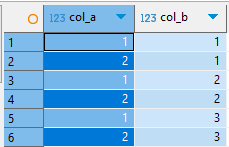
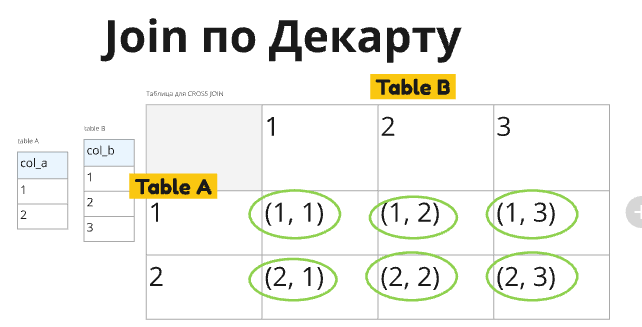

# Cross Join

**Cross Join** - прямое декартово произведение двух таблиц. Каждая строка первой таблицы соединяется со всеми строками второй 

### Вариант 1

#### Код

```sql
with tab_A as (
	select generate_series(1, 2) as col_A
	),
tab_B as (
	select generate_series(1, 3) as col_B
	)
select *
from tab_A
	cross join
	tab_B
;
```

#### Вывод


#### Теория

