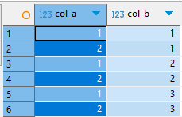
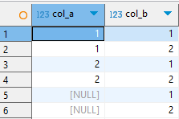
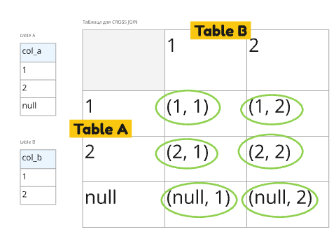

# Cross Join

**Cross Join** - прямое декартово произведение двух таблиц. Каждая строка первой таблицы соединяется со всеми строками второй 

### Без null

#### Код

```sql
with tab_A as (
	select generate_series(1, 2) as col_A
	),
tab_B as (
	select generate_series(1, 3) as col_B
	)
select *
from tab_A
	cross join
	tab_B
;
```

#### Вывод


#### Теория


### С null в таблице A

#### Код

```sql
create temp table tab_A (col_a int);
insert into tab_A values (1), (2), (null);

create temp table tab_B (col_b int);
insert into tab_B values (generate_series(1, 2));

select * from tab_A
	cross join tab_B;
```

#### Вывод


#### Теория


