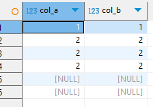

# Left Join

**Left Join**. Мы вычисляем декартово произведение из двух таблиц. Затем мы фильтруем строки по условию `on`, оставляем только `TRUE` по условию. Если для строки из левой таблицы нет `TRUE` соответствия в правой, мы включаем строку из левой с `null` вместо данных из правой таблицы


### Без null, без повторений

#### Код

```sql
with tab_A as (
	select generate_series(1, 3) as col_A
	),
tab_B as (
	select generate_series(2, 4) as col_B
	)
select *
from tab_A
	left join
	tab_B
	on tab_A.col_A = tab_B.col_B
;
```

#### Вывод


#### Теория


### С повторениями в A

#### Код

```sql
create temp table tab_A (col_a int);
insert into tab_A values (1), (2), 
	(2), (2), (null), (null);
create temp table tab_B (col_b int);
insert into tab_B values 
	(generate_series(1, 3));

select * from tab_A
	left join tab_B
	on tab_A.col_A = tab_B.col_B
;
```

#### Вывод


#### Теория


### С повторениями в B

#### Код

```sql
create temp table tab_A (col_a int);
insert into tab_A values (1), (2), 
	(3), (null);
create temp table tab_B (col_b int);
insert into tab_B values 
	(1), (1), (1), (null), (null), (null);

select *
from tab_A left join tab_B
	on col_a = col_b
;
```

#### Вывод


#### Теория


### С повторениями в А и B

#### Код 

```sql
create temp table tab_A (col_a int);
insert into tab_A values (1), (1), 
	(2), (2), (2), (4), (null), (null);
create temp table tab_B (col_b int);
insert into tab_B values 
	(2), (2), (3), (null);

select *
from tab_A left join tab_B
	on col_a = col_b
;
```
#### Вывод


#### Теория


